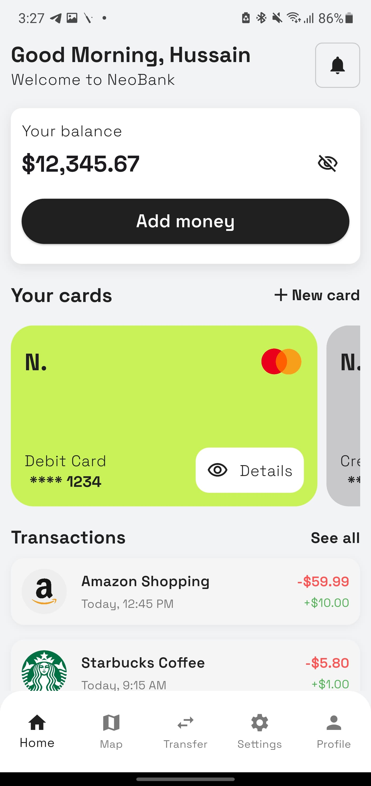
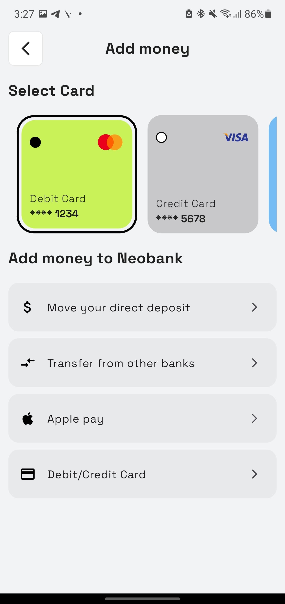
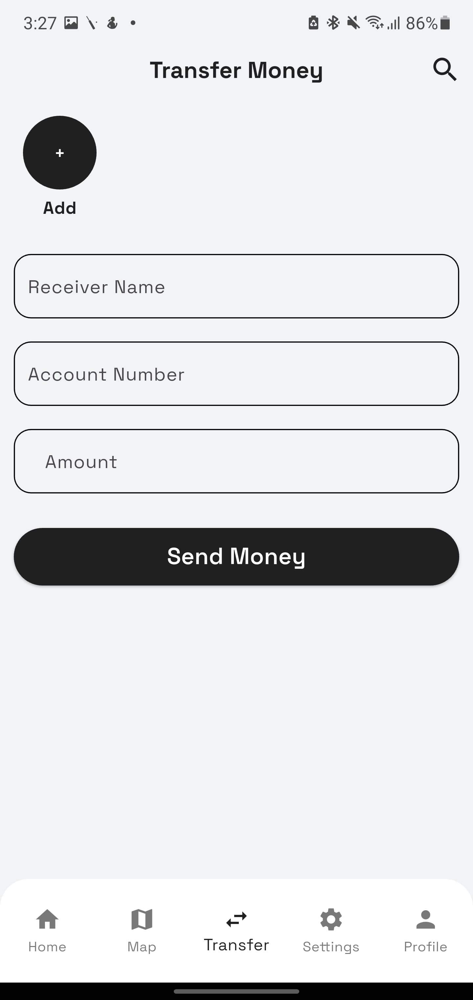
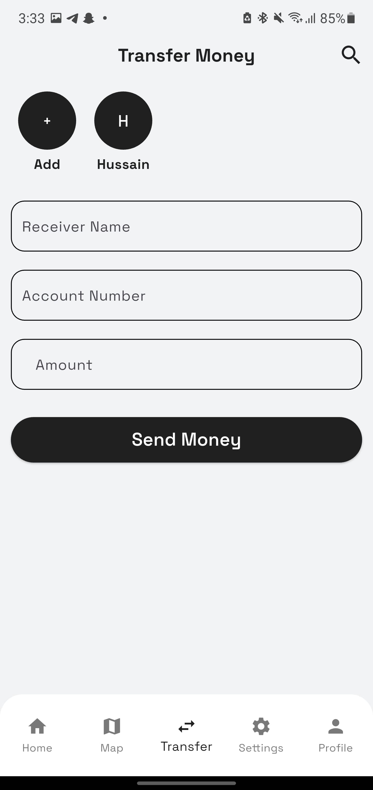
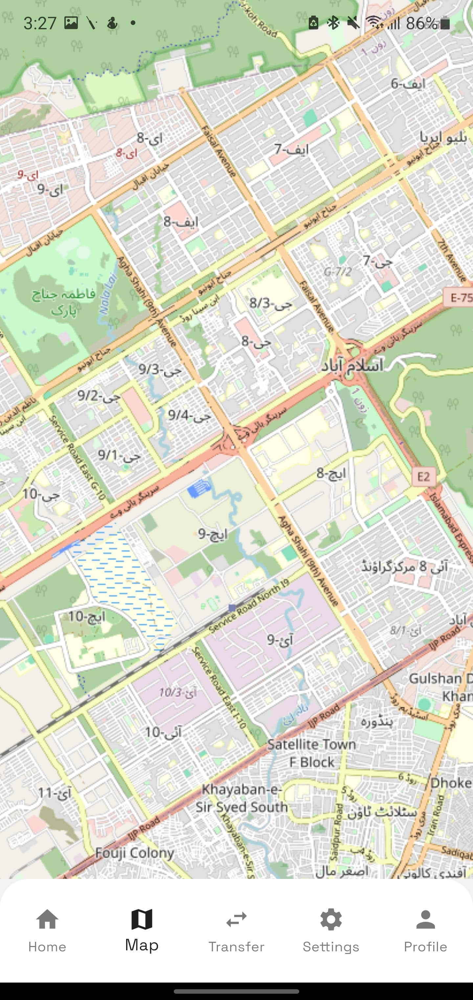
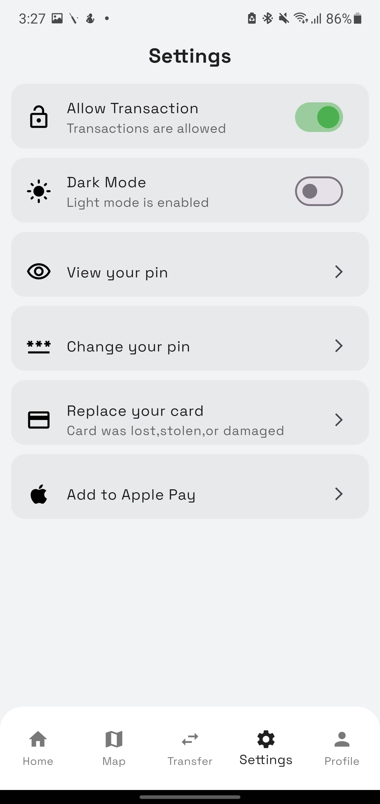

# 💳 Transaction Application

A modern Flutter application for managing and tracking your money — clean, fast, and user-friendly.

## 🚀 Features

- 🌍 **OpenStreetMap Integration**  
  View locations, search places, and draw routes using OpenStreetMap and OpenRouteService.

- 🏠 **Home Page with Smart Cards**  
  - Quick access to features like Send Money, Add Money, and Pay Bills  
  - Beautiful card UI showing balance and transaction actions

- 🔁 **Transaction History**  
  View past transactions with full details in a timeline-style interface.

- ➕ **Add Money**  
  Add funds using integrated UI — simple and intuitive.

- ⚙️ **Settings Page**  
  Customize app preferences (light/dark theme coming soon), language settings, and more.

- 👤 **Profile Page**  
  View and update user profile information.

- 📇 **Saved Contacts**  
  - Add/Remove contacts with custom initials  
  - Saved locally using `SharedPreferences`  
  - Tap to autofill recipient info

## 📸 Screenshots

> 💡 _Put these screenshots inside a `screenshots/` folder in your project root_
### 🏠 Home Page
 ### ➕ Add Money 
### 👥 Contacts and Transfer
 
## Map Page
 ### Profile Page 
###Setting Page



---

## 📦 Getting Started

To run this project locally:

```bash
git clone https://github.com/your-username/transaction_application.git
cd transaction_application
flutter pub get
flutter run
